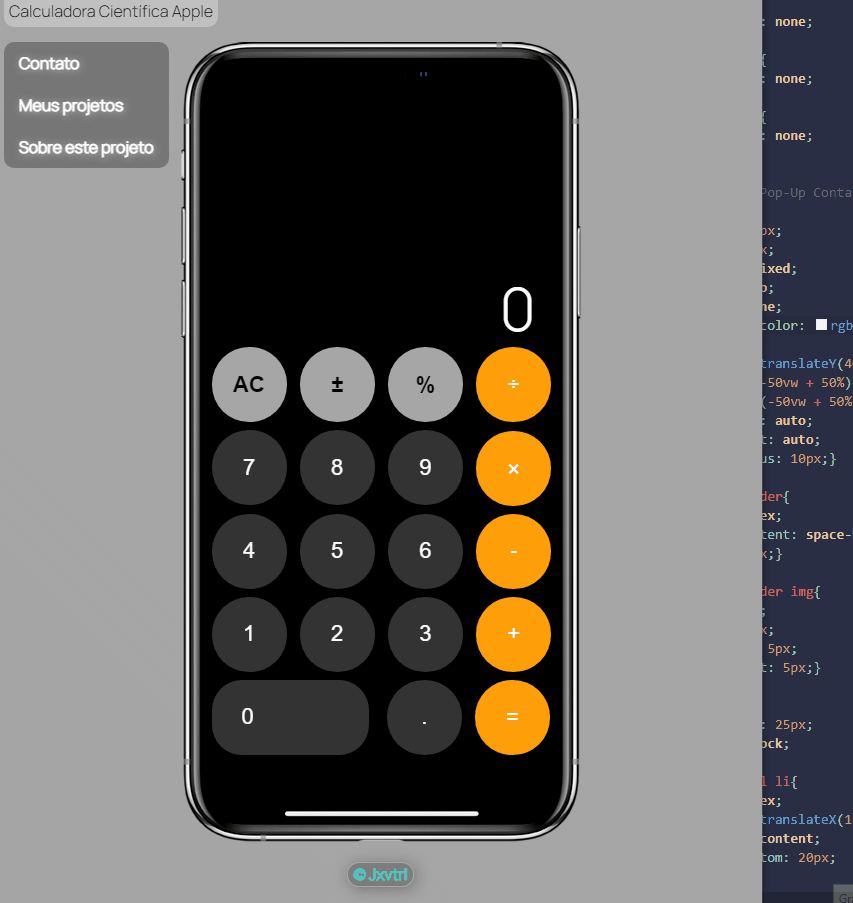

<h1>Calculadora Completa Apple Iphone</h1>
<p>
Neste projeto tentei botar todos meus conhecimentos iniciais da trinca js html e css para construir uma calculadora funcional cujo translaciona para alterar o modo.
</p>
<center></center>
## Principais passos do projeto

- Procurei um template para usar no projeto e selecionei o layout do iphone X
- Reutilizar o código do projeto anterior implementando a alteração de modo via 

```css
@media (max-width: 850px)
```
- Criação de uma div Cientifica que ativaria seu display ao entrar no novo modo
- Apartir deste ponto tive de lidar com o problema do resultado não limitava ao tamanho da div
```js
if(w <= 850){
            if(Number(res.innerHTML.length) < 8){
                res.innerHTML += num
            } 
        }
        else{
            if(Number(res.innerHTML.length) < 26){
                res.innerHTML += num
            } 
        }
```

- Após este ponto a calculadora não tinha uma limitancia de Erro, qualquer operação resultaria, podendo haver um erro de resultado por causa de lixo de memoria.
```js
if(resultado){
                try {
                    res.innerHTML = eval(resultado); 
                } 
                catch (e) {
                    if (e instanceof SyntaxError) {
                        res.innerHTML = 'ERRO';
                    }
                }
            }
```
- O botão de reset também foi outra dor de cabeça, sabia que ao digitar algo na calculadora ele alterava de AC para C e ao resetar, voltava ao normal.
```js
function inserir(num){
    if(res.innerHTML === '0'){
        res.innerHTML = ''
        res.innerHTML += num
        ac.innerHTML = 'C'
    }
    else{
        ac.innerHTML = 'C'
        if(w <= 850){
            if(Number(res.innerHTML.length) < 8){
                res.innerHTML += num
            } 
        }
        else{
            if(Number(res.innerHTML.length) < 26){
                res.innerHTML += num
            } 
        }
    }
}
```
<p style='text-align: center;'>^^Nesta função a alteração se deve a atribuição a const "AC" o valor "C"^^</p>

```js
function reset(){
    res.innerHTML = '0'
    ac.innerHTML = 'AC'
}
```
<p style='text-align: center;'>^^E para a funcionalidade funcionar para voltar ao normal ao reset, atribuí a mesma const o valor original^^</p>


## Próximos passos deste projeto

- Criar um recurso de botão para alterar o modo da calculadora

## Contribuição ao projeto
Se quiser, manda suas pull requests! Para mudanças críticas, por favor crie uma issue primeiro para a discussão das mudanças. Obrigado!


## License
[MIT](https://choosealicense.com/licenses/mit/)
